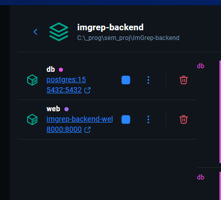

 # Prerequisites
  ###  Windows
 - Windows 10/11 with Docker Desktop and wsl enabled
 - Docker Desktop: [Download](https://www.docker.com/products/docker-desktop/)
    ```bash
    # Test installation
    docker --version
    ```
  ### Linux/Macos
- install docker 


 # Quick Setup

 1. **Create Project**
    ```bash
    git clone <repo>
    cd repo
    ```

 2. **Start Project**
   ```bash
   # Start all services
   docker-compose up --build
   ```

3. **You should get this on your docker desktop**



4. **Test API**
    - Test endpoint: http://localhost:8000/

 # Project Structure
 ```
   imgrep-backend/
   ├── docker-compose.yml       # Docker services config
   ├── Dockerfile               # Flask environment setup
   ├── requirements.txt         # Python packages
   ├── .env                     # Environment variables
   ├── app.py                   # Main Flask app
   └── src/
      ├── routes/
      │   ├── __init__.py      # Blueprint init
      │   ├── test.py          # Example endpoints
      └── db/
         └── models.py        # SQLAlchemy models

 ```

 # Daily Development Workflow

 ### Starting Work
 ```bash
 # Start all services
 docker-compose up

 # Or run in background
 docker-compose up -d
 ```

 ## Making Changes
 1. **Code Changes**
    - Edit Flask routes in src/routes/test.py
    - Changes are automatically reloaded (no restart needed)

 2. **Database Changes**
    ```bash
      docker-compose exec web flask db migrate
      docker-compose exec web flask db upgrade

    ```

 3. **Adding New Packages**
    - Add package to requirements.txt
    - Rebuild: `docker-compose up --build`


 ## Stopping Work
 ```bash
 # Stop services
 docker-compose down

 # Stop and remove all data
 docker-compose down -v
 ```

 ## Common Development Tasks
 ### Add New API Endpoint
 1. Add view function in `src/routes/test.py`:
    ```python
    @bp.route("/hello", methods=["GET"])
      def hello():
         return jsonify({"message": "Hello from Flask!"})

    ```
    
 2. Register the route in app.py or blueprint:
    ```python
      from src.routes.test import bp as test_bp
      app.register_blueprint(test_bp)
    ```
    

 ### Database Shell
   ```
   docker-compose exec db psql -U postgres -d imagedb
   ```
   for gui use :
   ```
   Host: localhost
   Port: 5432
   User: postgres
   Password: password123
   Database: imagedb

   ```
 
 ### Environment Variables
 - Edit `.env` file for configuration
 - Restart services: `docker-compose down && docker-compose up`

 ## Troubleshooting
 ### Common Issues
 ```bash
 # Port already in use
 docker-compose down
 docker-compose up

 # Database connection issues
 docker-compose exec web python manage.py migrate

 # Package not found
 docker-compose up --build

 # Clean restart
 docker-compose down -v
 docker-compose up --build
 ```

 ### Useful Commands
 ```bash
 # View running containers
 docker ps

 # View all logs
 docker-compose logs

 # View specific service logs
 docker-compose logs web
 docker-compose logs db

 # Access container shell
 docker-compose exec web bash

 # Database shell
 docker-compose exec db psql -U postgres -d imagedb
 ```


# File Locations
 ### Add API Logic
 - Views: `src/api/views.py`
 - URLs: `src/api/urls.py`
 - Models: `src/api/models.py` (create if needed)

 ### Configuration
 - Django Settings: `src/settings.py`
 - Database: `docker-compose.yml`
 - Packages: `requirements.txt`

## cheers!!